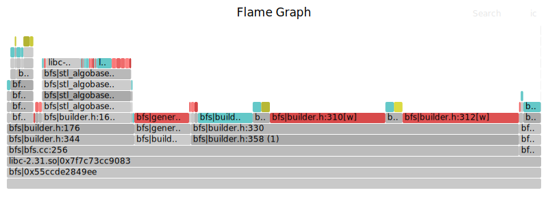

# fltsites
Tool to capture page faults along with their callsites.

#### Requirements
- Linux kernel 5.9 or higher (recently tested on 5.15)
- [jemalloc](https://github.com/jemalloc/jemalloc). To set-up jemalloc, run:
    ```
    ./deps.sh --force
    ```
-  [addr2line](https://man7.org/linux/man-pages/man1/addr2line.1.html)
- python3

#### Build
```
make clean
make

# if needed, try the following flags for debugging
make SAFEMODE=1   # build tool with a bunch of safety checks
make DEBUG=1      # build tool with (very) verbose logging
```

#### Run
1. To record a trace, run:
    ```
    fltsites record -L <localmem> -M <maxmem> -- <command>
    ```
    - `-L` (Local/mapped memory limit) and `-M` (max memory the command needs to run) are required arguments (in MB); there should be enough memory on the system to hold both these sizes (combined) and max memory should be enough to hold the command's resident memory at its peak. See `fltsites --help` output for more options.
    - The tool will output a trace file (default: `fltsites-data-faults-<pid>-<hcore>.out`) in the current directory, one per each process that the command spawns and for each tracing thread (See `--cores` option). The trace contains one fault per line with fault information like timestamp, page address, the call stack and some flags (defined in `inc/rmem/fsampler.h`) among others.  It also saves `/proc/pid/maps` as `fltsites-data-procmaps-<pid>.out` for each process to lookup the source code locations later and a stats file `fltsites-data-stats-<pid>.out` with some statistics on the run (for debugging). 

2. To parse the tool output and report the call-sites (source code locations) ordered by their faulting frequency, run:
    ```
    fltsites report
    ```
    - This will look back into libraries to figure out callsites and output a csv-formatted file `fltsites-data-report-<pid>.out` with information grouped by callsites.

3. To visualize the reported source code locations (currently in a 
flamegraph style), run:
    ```
    fltsites visualize
    ```
    - This will output a flamegraph svg file `fltsites-flamegraph.svg` after collapsing callstacks which shows them by their page fault frequency. It also outputs another flamegraph just for allocation faults. Use your favorite browser/svg-viewer to view the svg files.

#### Example
With a GAPBS BFS workload (https://github.com/sbeamer/gapbs.git) 
```
git clone https://github.com/sbeamer/gapbs.git
cd gapbs/
make CXX_FLAGS="-g"     # build with debug symbols
cd ..
./fltsites record -L=1000 -M=1000 -- ./gapbs/bfs -g 20 -n 1      # run with ample memory (1GB)
cat fltsites-data-stats-<pid>.out | grep -o "memory_used:\([0-9]\+\)" | tail -1      # max memory used by the command  
./fltsites record -L=140 -M=1000 -- ./gapbs/bfs -g 20 -n 1       # re-run with half the memory to generate faults (140 MB)
./fltsites report 
./fltsites visualize
```
The above commands will generate a flamegraph svg file `fltsites-data-flamegraph-<pid>.svg` which looks like this:

